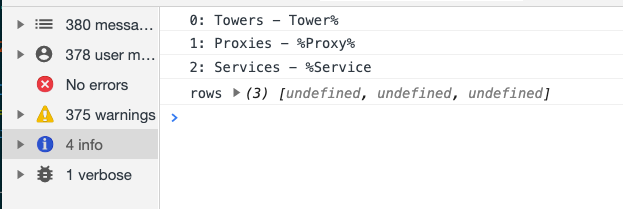
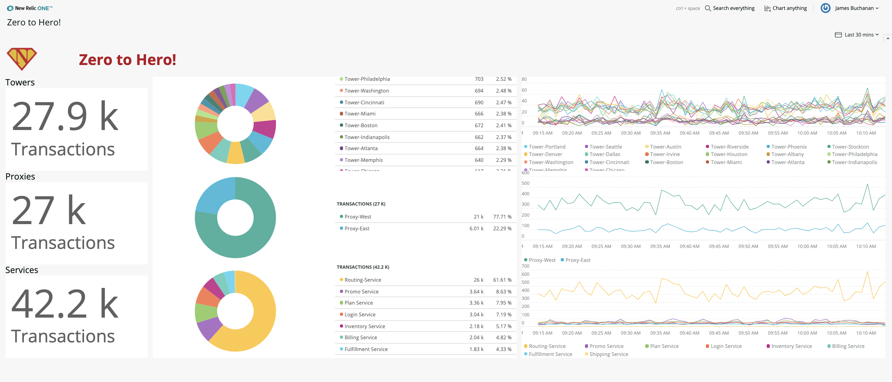
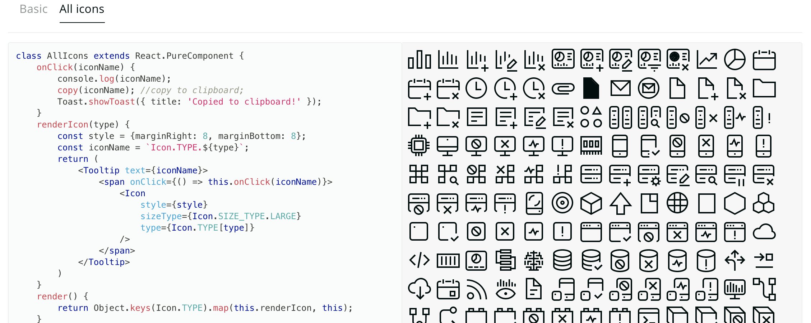
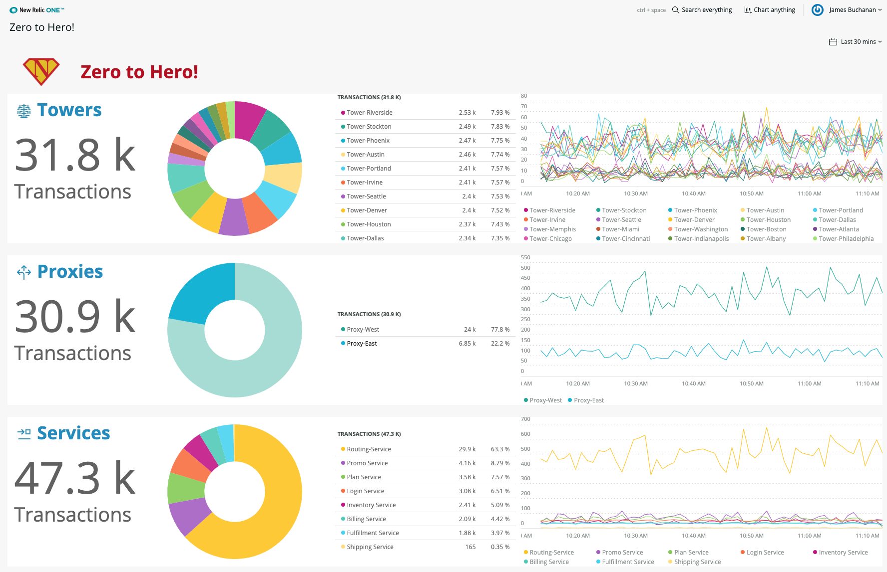

# Chapter 6 - Multiple Rows

In this chapter we look at how to dynamically generate multiple charts on the page by driving them from configuration. This is an important pattern that reduces the code verbosity and makes it easier to re-configure. We also look at console notifications and warnings and learn how to use the `Icon` component to spruce things up a bit.


## 1. Configuration driven code

Currently our app is pretty straightforward, but if we want to add multiple rows of charts as in the [mockup](../chapter-05/screenshots/mockup.png) then we would quickly end up with very large unreadable source code. In situations like this it is good to drive the code with configuration. The configuration is a simple object that contains the information thats different for each row, we then generate the code from that.

For this application we want a row of charts for each type of application. The current row is aggregating all the applications prefixed "Tower". Lets group together the "service" and "proxy" apps into rows too. So that would be three groups, or three rows.

> As you are sing your own data and queries just find something like appName or transaction name that seperates the data into a number of discrete groups that you can filter by.


### 1a. Define the configuration

An array seems to be a sensible structure to store our configuration. Each element of the array will be an object that defines the specifics of each row.

Just after where the `appName` variable is defined add a new variable definition for the `appConfig` object:

```jsx
const appConfig=[
      {
          name: "Towers",
          likeClause: "Tower%"
      },
      {
          name: "Proxies",
          likeClause: "%Proxy%"
      },
      {
          name: "Services",
          likeClause: "%Service"
      }
  ]
```

You can see that the object contains two pieces of information for each row. The **name** is a friendly name to show as a heading and the **likeClause** defines what the like clause of the query should look like, including wildcards.


### 1b. Generate the code from configuration

Now we have some configuration we can generate the code for it. We need to iterate over the **appConfig** array and for each element generate a row of data.

Immediataly after where appConfig is defined add the following `.map()` code to iterate over the configuration:

```jsx
const rows = appConfig.map((row,index)=>{
    console.log(`${index}: ${row.name} - ${row.likeClause}`)
})
console.log("rows",rows)
```

Look in the Chrome inspector console under the Info pane (`CMD+ALT+J`). You should see that a log line has been printed out for each item in the configuration array showing the name and likeClause values. You will also see that the **rows** array is 3 items large but each item is `undefined`:




> The javascript  [`.map()`](https://developer.mozilla.org/en-US/docs/Web/JavaScript/Reference/Global_Objects/Array/map) method **creates a new array** populated with the results of calling a provided function on every element in the calling array. Its similar to the [`.forEach()`](https://developer.mozilla.org/en-US/docs/Web/JavaScript/Reference/Global_Objects/Array/forEach) method except it always returns a new array. Both are very useful for iterating over arrays!

We need to add a return value in our iterator to return a row of charts for each item. In simplified terms this looks like this:

```jsx
const rows = appConfig.map((row,index)=>{
    return <Grid>...All the GridItems and charts go here...</Grid>
})
```

We already have everything we need for this in the the code where the charts are rendered, we need to move that piece of code into our iterator function and then change the like clauses appropriately. Here is the updated definition of `rows`:

```jsx
const rows = appConfig.map((row,index)=>{
  console.log(`${index}: ${row.name} - ${row.likeClause}`)
  return <Grid>
      <GridItem columnSpan={2}>
          <HeadingText tagType={HeadingText.TAG_TYPE.H2}>
              {row.name}
          </HeadingText>
          <BillboardChart
              accountId={accountId}
              query={`select count(*) as 'Transactions' FROM Transaction where appName like '${row.likeClause}'`}
              fullWidth
          />
      </GridItem>
      <GridItem columnSpan={5}>
          <PieChart
              accountId={accountId}
              query={`select count(*) as 'Transactions' FROM Transaction where appName like '${row.likeClause}' facet appName limit max`}
              fullWidth
              fullHeight
          />
      </GridItem>
      <GridItem columnSpan={5}>
          <LineChart
              accountId={accountId}
              query={`select count(*) as 'Transactions' FROM Transaction where appName like '${row.likeClause}' facet appName limit max timeseries`}
              fullWidth
              fullHeight
          />
      </GridItem>
  </Grid>  
})
console.log("rows",rows)
```

> Notice that we have changed all three like clauses, replacing their values with `${row.likeClause}` and have removed the `%` symbol (as the wildcard is now included in the config). We have also changed the HeadingText component to use the name from the config rather than `appName` variable.


If you look in the inspector now you should see the **rows** variable is now an array of react objects:


So now the **rows** variable contains three `<Grid>` components, one for each item in our configuration. We now need to replace the orginal `<Grid>` from the `return` block with our **rows** variable. This is done by including it in curly braces:

```jsx
{rows}
```


Here is the full `render()` method:

```jsx
render() {
    const accountId=1
    const appConfig=[
        {
            name: "Towers",
            likeClause: "Tower%"
        },
        {
            name: "Proxies",
            likeClause: "%Proxy%"
        },
        {
            name: "Services",
            likeClause: "%Service"
        }
    ]
    const rows = appConfig.map((row,index)=>{
        console.log(`${index}: ${row.name} - ${row.likeClause}`)
        return <Grid>
            <GridItem columnSpan={2}>
                <HeadingText tagType={HeadingText.TAG_TYPE.H2}>
                    {row.name}
                </HeadingText>
                <BillboardChart
                    accountId={accountId}
                    query={`select count(*) as 'Transactions' FROM Transaction where appName like '${row.likeClause}'`}
                    fullWidth
                />
            </GridItem>
            <GridItem columnSpan={5}>
                <PieChart
                    accountId={accountId}
                    query={`select count(*) as 'Transactions' FROM Transaction where appName like '${row.likeClause}' facet appName limit max`}
                    fullWidth
                    fullHeight
                />
            </GridItem>
            <GridItem columnSpan={5}>
                <LineChart
                    accountId={accountId}
                    query={`select count(*) as 'Transactions' FROM Transaction where appName like '${row.likeClause}' facet appName limit max timeseries`}
                    fullWidth
                    fullHeight
                />
            </GridItem>
        </Grid>  
    })
    return <>
        <Grid>
            <GridItem columnSpan={1}></GridItem>
            <GridItem columnSpan={11}>
                <HeadingText 
                    tagType={HeadingText.TAG_TYPE.H1}
                    className="MainHeading"
                >
                    Zero to Hero!
                </HeadingText>
            </GridItem>
        </Grid>
        {rows}
    </>
}
```


Save the changes and you should now see three rows rendering like this:




## 2. Tidying up

Lets fix a few warnings and improve the layout a touch...

### 2a. Fix the warning

If you are observant you will notice that there is now an error showing in the Chrome inspector window. Open it up and lets see what it says:


The message tells us that each element within an array must have a unique "key" property. React needs to know how to update components and to do this it must have a unique reference to them. We just created an array called **rows** and rendered it in the render method of our nerdlet, so we must have caused the problem!

The fix is simple, each root node for each element in the **rows** array (`<Grid>` in our case) must have a "key" attribute provided with a unique value. The `.map()`and `.forEach()` already provide us a unique **index** value for each item being iterated, so we can use that as the value for our key.

In the definition of **rows** amend the `return ...` line within the iterator we added as follows:

```jsx
return <Grid key={index}>
```

> `index` is a variable indicating the element index from the array being iterated over. It starts at zero and is incremented by one for each item.


Save the changes and review the Chrome inspector again. You should see no errors now. This is a common thing to miss, I recommend you fix these errors as soon as you see them otherise they can be a little tricky to track down later.


### 2b. Tweak the layout

Its all looking a bit disjointed. Lets add some styling to neaten up the rows by giving them a white background, some margin in between and styling the headings. We'll also add a few icons, just for fun.

Add the following CSS rules to `styles.scss`:

```css
.AppIcon {
    text-align:center;
}
.ChartRow {
    background-color: white;
    height: 300px;
    margin-bottom:2em;
    h2 {
        color:#248bbc;
        font-size: 3em;
        font-weight:bold;
        padding: 0.5em 0 0 0.5em;
    }
}
```

Now add the "ChartRow"class as a `className` attribute to the `<Grid>` component in our iterator function:

```jsx
return <Grid key={index} className="ChartRow">
```

Also add the "AppIcon" class to the `<GridItem>` containing the icon (this just center aligns it)

```jsx
<GridItem columnSpan={1} className="AppIcon"></GridItem>
```


### 2c. Add some Icons

This is looking a lot better now, but lets add some icons. The NR1 component library comes with a handy `<Icon>` component that we can use to quickly add icons to our application. 

Find the documentation for the [icon component](https://developer.newrelic.com/client-side-sdk/index.html#components/Icon). In the Examples section click on "All Icons" . You will see all the icons rendered so you can easily choose what you need. You can click on an icon and its type is copied to clipboard. Very useful!




The attribute **type** is required, this indicates the icon you want. There are some other attributes to control layout, we'll also use **sizeType** to make the icon large.

First, lets extend our configuration to include an icon for each row. We'll add a new attribute **icon** and its value is the type of icon we want.

```jsx
const appConfig=[
    {
        name: "Towers",
        icon: Icon.TYPE.HARDWARE_AND_SOFTWARE__SOFTWARE__CORRELATION_REASONING,
        likeClause: "Tower%"
    },
    {
        name: "Proxies",
        icon: Icon.TYPE.HARDWARE_AND_SOFTWARE__SOFTWARE__DECISIONS,
        likeClause: "%Proxy%"
    },
    {
        name: "Services",
        icon: Icon.TYPE.HARDWARE_AND_SOFTWARE__SOFTWARE__DESTINATIONS,
        likeClause: "%Service"
    }
]
```


Now add "Icon" to the list of imported components at the import statement at the top of the script then amend the `<HeadingText>` component to include the icon next to the application name:

```jsx
import { Grid, GridItem, HeadingText, PieChart, LineChart, BillboardChart, Icon } from 'nr1'
```

```jsx
<HeadingText tagType={HeadingText.TAG_TYPE.H2}>
    <Icon sizeType={Icon.SIZE_TYPE.LARGE} type={row.icon} /> {row.name}
</HeadingText>
```


This is what the app  should look like now:




---

[Continue to Chapter 7](../chapter-07)


**FEEDBACK!**

Please provide feedback about this chapter or the course in general via email (jbuchanan@newrelic.com) a **pull request** or via the [feedback form](https://forms.gle/STjad8z2YkdzwAWJA).